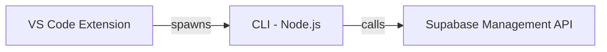

# Supabase DX Monorepo

## What Is This?

A **new CLI + VS Code extension** for experimenting with Supabase developer experience ideas.

**Key difference from official Supabase CLI:**

- Uses **Supabase Management API directly** (REST calls, not wrapping CLI)
- Experiments with **new DX patterns** (profiles, git-awareness, watch mode)
- Follows same `./supabase` directory convention for familiarity

## Problem Statement

**Supabase development across multiple environments is fragmented and manual.**

Current pain points:

- **Context switching is painful** - When you switch branches or move between dev/staging/prod, you manually have to fetch config, update env vars, and ensure your local state matches the target.
- **No unified workflow** - No single abstraction for "get me in sync with remote" or "apply my changes to staging."
- **Environment drift** - Teams lack visibility into what's different between local and remote.
- **Manual, error-prone deploys** - Pushing changes requires remembering the right sequence of commands.

## Why This Tool

**Simple commands that do the right thing based on context:**

- `pull` = "I switched context, bring me up to speed" (remote → local)
- `push` = "I'm ready, apply my changes" (local → remote)
- `watch` = "Keep things running as I work" (continuous)

The **profile** concept is key: instead of hardcoding what "push" means, each profile (dev/staging/prod) defines its own behavior. This keeps the CLI surface small while supporting complex team workflows.

**Why a VS Code extension?** Most developers live in their editor. The extension surfaces the CLI in the UI - status bar, tree views, commands - without needing to context-switch to a terminal.

## Git-Aware + Dev Mode Preferences

**Watch git branch changes:**

- Detects when you switch branches (via `watch` mode or extension)
- Can auto-switch profiles based on branch conventions (e.g., `feature/*` → local, `staging` → staging profile)
- Or prompts you: "You switched to `feature/auth`, use local dev profile?"

**Dev mode preferences** - profiles encode how you prefer to develop:

- **Local** - Run Supabase locally via Docker (`supabase start`). Fully offline, fast iteration.
- **Preview branches** - Use Supabase's preview branch feature - each git branch gets its own remote DB.
- **Remote** - Connect directly to a shared dev/staging/prod Supabase project.

A profile specifies:

- Which mode (local / preview / remote)
- Which Supabase project/branch to sync with
- What `pull` and `push` mean for that mode
- Branch matching rules (optional: auto-select profile based on git branch)

**Config location:** We use the `./supabase` directory convention. Profiles are stored in `./supabase/config.toml`.

Example `./supabase/config.toml`:

```toml
[project]
id = "my-project-id"

[profiles.local]
mode = "local"
branches = ["feature/*", "fix/*"]  # auto-select for these branches

[profiles.preview]
mode = "preview"
branches = ["preview/*"]

[profiles.staging]
mode = "remote"
branches = ["staging", "main"]
```

## Supabase Workflow Modes

Supabase supports two different workflows. Our tool handles both:

### Git Workflow (GitHub Integration)

- GitHub branches auto-create Supabase preview branches
- Every commit triggers migration deployment
- Migrations, config, edge functions all live in `./supabase` directory in git
- Merging a PR deploys to production automatically
- **Best for:** teams, production, CI/CD pipelines

### Non-Git Workflow (Dashboard-first)

- Make schema changes directly in Supabase dashboard
- Use `supabase db diff` to capture changes into migration files
- No automatic sync between git and Supabase
- **Best for:** prototyping, solo devs, quick iteration

### How the CLI handles both

**`pull`**

- Git workflow: Fetch migrations/config from git, apply to local
- Non-git workflow: Fetch schema from remote via `db diff`, optionally apply to local

**`push`**

- Git workflow: Commit migrations to git, let GitHub integration deploy
- Non-git workflow: Push migrations directly to remote via CLI

**`watch`**

- Git workflow: Watch git + files, auto-rebuild locally
- Non-git workflow: Watch files, regenerate types, optionally push on save

The profile config specifies which workflow (in `./supabase/config.toml`):

```toml
[profiles.dev-git]
mode = "local"
workflow = "git"  # uses GitHub integration

[profiles.dev-dashboard]
mode = "local"
workflow = "dashboard"  # captures dashboard changes
```

## Declarative Schema Support

Supabase supports declarative schemas where you define the desired state in `supabase/schemas/*.sql` and generate migrations via `supabase db diff`.

Our tool integrates with this:

**`pull`** - Fetches remote schema, updates `supabase/schemas/` files

**`push`** - Runs `supabase db diff` to generate migration, then applies

**`watch`** - Watches `supabase/schemas/` for changes, auto-regenerates migrations

Profile config (in `./supabase/config.toml`):

```toml
[profiles.dev]
mode = "local"
schema = "declarative"  # uses supabase/schemas/ directory
# vs schema = "migrations"  # traditional migrations only
```

## Structure

```
supabase-dx/
├── cli/                        # CLI (Node.js + Ink)
│   ├── src/
│   │   ├── cli.tsx             # Entry point (Commander)
│   │   ├── commands/           # Command implementations
│   │   │   ├── login.tsx       # Interactive login with Ink
│   │   │   ├── projects.tsx    # List projects table
│   │   │   ├── pull.tsx        # Pull with progress UI
│   │   │   ├── push.tsx        # Push with confirmation
│   │   │   └── watch.tsx       # Watch mode with events
│   │   ├── components/         # Reusable Ink components
│   │   │   ├── Spinner.tsx
│   │   │   └── Table.tsx
│   │   └── lib/                # Core logic
│   │       ├── api.ts          # Management API client
│   │       ├── config.ts       # Profile/config loader
│   │       └── git.ts          # Git utilities
│   ├── package.json
│   ├── tsconfig.json
│   └── tsup.config.ts          # Build config
│
├── extension/                  # VS Code extension (TypeScript)
│   ├── src/
│   │   └── extension.ts
│   ├── package.json            # VS Code manifest
│   └── tsconfig.json
│
├── skills/                     # AI/LLM skills (publishable)
│   ├── supabase-cli/
│   │   └── SKILL.md            # How to use the CLI
│   ├── supabase-workflows/
│   │   └── SKILL.md            # Git vs dashboard workflow guidance
│   └── README.md
│
├── examples/
│   └── sample-project/         # Test project with ./supabase dir
│       └── README.md
│
├── docs/
│   └── PLAN.md                 # Project plan/architecture doc
│
├── package.json                # Root workspace
├── pnpm-workspace.yaml
├── turbo.json
└── .gitignore
```

## Architecture



- **CLI** (Node.js + Ink) - contains all business logic, calls Management API directly
- **Extension** (TypeScript) - spawns CLI with `--json`, parses output, displays in VS Code
- **Management API** - REST API for managing Supabase projects (no dependency on official CLI)

## CLI (`cli/`)

Written in **Node.js** with **Ink** (React for CLIs) for interactive UI.

**Why Node.js + Ink?**

- Same language as extension (TypeScript everywhere)
- Ink provides React-based component model for TUIs
- Easy to share types between CLI and extension
- Rich npm ecosystem for utilities

**Internal structure:**

- `src/commands/` - React components for each command (login, projects, pull, push, watch)
- `src/lib/config.ts` - profile system (reads `./supabase/config.toml` via `toml` package)
- `src/lib/api.ts` - Supabase Management API client (fetch-based)
- `src/lib/git.ts` - Git utilities (branch detection, repo info)
- `src/components/` - Reusable Ink components (Spinner, Table, Status)

**Commands:**

- `supa login [--token <token>]` - Authenticate with PAT
- `supa projects` - List all projects
- `supa pull [--profile <name>] [--dry-run] [--types-only]`
- `supa push [--profile <name>] [--dry-run] [--yes]`
- `supa watch [--profile <name>] [--types-interval <duration>]`

(Name TBD - using `supa` as placeholder)

**Output modes:**

- Interactive TUI (default) - Ink UI with spinners, tables, prompts
- JSON (`--json`) - machine-readable for extension/scripts

**Uses Management API directly:**

- Calls Supabase REST API for projects, databases, functions, branches, types, etc.
- No dependency on official `supabase` CLI binary

## Extension (`extension/`)

- UI wrapper only - spawns CLI commands under the hood
- Parses CLI JSON output to display in VS Code
- Provides: commands, status bar, tree views, notifications
- Zero business logic

## Skills (`skills/`)

AI/LLM skills so assistants (Cursor, Codex, etc.) can help users:

- **supabase-cli** - How to use the CLI (pull/push/watch commands, `./supabase/config.toml`, flags, examples)
- **supabase-workflows** - Guidance on git vs dashboard workflow, local vs preview vs remote, when to use each

These are publishable - users can install them into their Cursor/Codex skills directory.

## Tooling

**CLI (Node.js):**

- Node.js 20+
- Ink 5 + React 18 (interactive TUI)
- Commander (CLI framework)
- tsup (bundler)
- Zod (validation)
- Conf (global config storage)

**Extension (TypeScript):**

- pnpm
- esbuild for bundling
- @types/vscode
- vitest for tests

**Monorepo:**

- pnpm workspaces
- Turborepo for orchestrating builds

## Root Scripts

- `pnpm build` - build CLI (tsup) + extension (esbuild)
- `pnpm dev` - watch mode for CLI development
- `pnpm test` - run tests (vitest for both CLI and extension)
